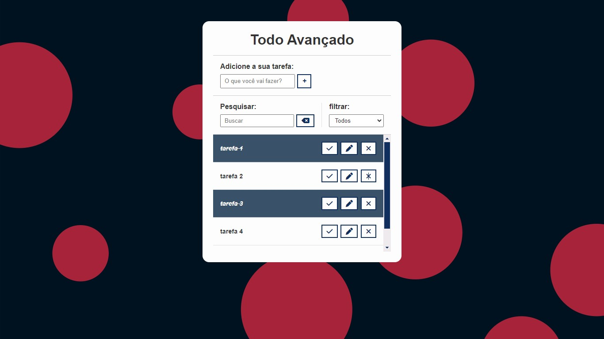

# Lista de tarefas

Este projeto é uma lista de tarefas onde o usuário pode:

1. Adicionar novas tarefas

1. Marcar tarefas como concluídas

1. Editar tarefas

1. Excluir tarefas

Todas essas ações são sincronizadas simultaneamente no local storage. Outras funcionalidades disponíveis incluem:

* Filtrar tarefas por concluídas e não concluídas

* Buscar tarefas por palavras-chave

_**Está responsivo para dotos os dispositivos**_ 📱💻

## Preview
clique [aqui](https://elson-341.github.io/todo_advanced/) para acessar o site.

